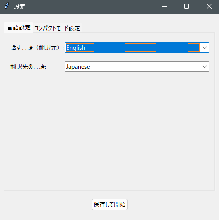
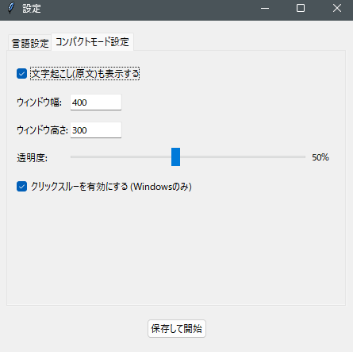

# For-English-Idiots-Only
英語ができないバカ(私を含む)用に作成された、完全ソースコード公開の無料のゲームに特化したボイスチャット翻訳ツール

# 概要
「日本語以外が全く分からない!! だけど、過疎った日本サーバーから逃げて海外サーバーでボイスチャットをしながらゲームをしたい!!」

という、傲慢で腹立たしい勉強をする気もないアホ(私を含む)の同志のために作成されたボイスチャット翻訳ツールです。

全然言葉はわからなくて聞き取れないのに意味はわかるという不思議な現象を体験できます。

これを使えば海外の知らないSquadプレイヤーから「指示したんだからさっさと動けよ。mother f**k!」と言われることも無くなります。多分

要約すると、"海外プレイヤーからのボイスチャットを文字起こしし、それを日本語に翻訳してゲームの画面に表示させるツール"です。(最初からそう言えよ)

# 機能

- Chromeを使った高精度な音声認識/文字起こし
- Google翻訳を使用した即時の翻訳
- 主要25言語に対応
- ゲーム画面の好きなところに翻訳結果と英文を表示
- 多様な設定項目
- わかりやすいGUI
- 自分の言葉を翻訳して音声で相手に伝える

その他いっぱい(?)...

# スクリーンショット

設定画面1 

設定画面2 

操作GUI 

コンパクトモードのGUI 

# 使用方法

以下の前提要件をクリア後、基本的には`main.exe`を実行すればokです。「これウイルスだろw」とかいう用心深い天才さんはmain.pyを使ってください。機能は同じです

# 動作前提

OS : Windows
macの民は滅びよ

VB-CABLEをインストール済みで"Cable output"と"Cable input"を既定値に設定済み (pc音声を入力に入れられるようにすればok)
Google Chromeをインストール済み

### 聞かれるかもしれない質問：
#### VB-CABLEのインストール方法を教えてください!
> [ここ](https://vb-audio.com/Cable/) からダウンロードできます。ダウンロード後はインストールをしてください。
>
> 設定の"システム>サウンド"に"スピーカー(VB-Audio Virtual Cable)"と"CABLE Output(VB-Audio Virtual Cable)"がそれぞれ出力と入力に追加されていればインストール成功です。
>
> その2つのデバイスを"オーディオの既定値"と"通信の既定値"に設定してください。

#### 既定値にしましたが、音が聞こえなくなりました!
> 正常です。聞こえるようにする方法を教えます
>
> "設定>システム>サウンド>サウンドの詳細設定"をクリックしてください。
>
> "録音"タブに行き、"CABLE Output"を右クリックし、"プロパティ"を開いてください。
>
> "聴く"タブに行き、"このデバイスを聴く"にチェックを付け、普段使っているスピーカーなどを選択してください。
> 
> 設定したら"OK"を押し、もう一度"OK"をクリックします。これで聞くことができます

### Google Chromeのインストール方法を教えてください!
> ggrks と言いたいところですがこれ以上悪口を重ねると流石にやばそうなのでリンクを張ります
> https://www.google.com/intl/ja/chrome/
